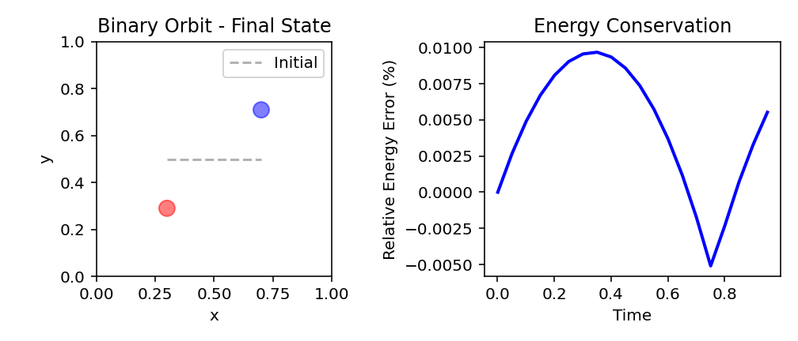
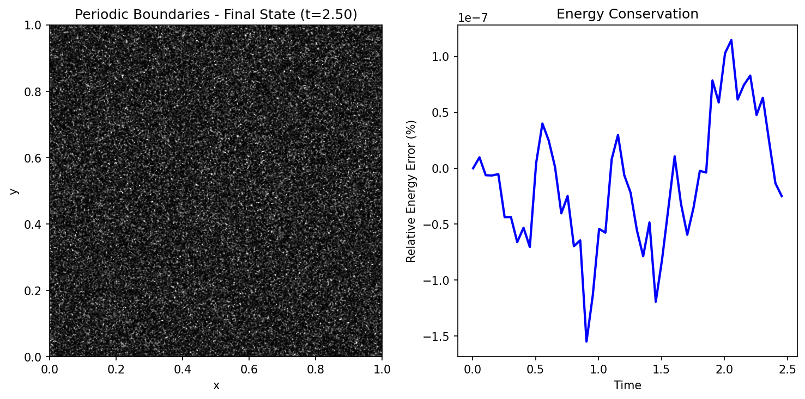
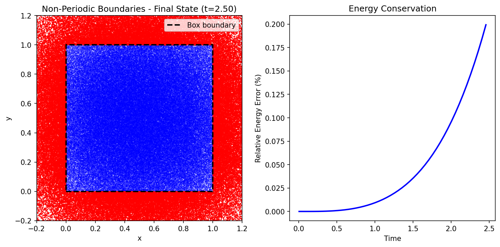
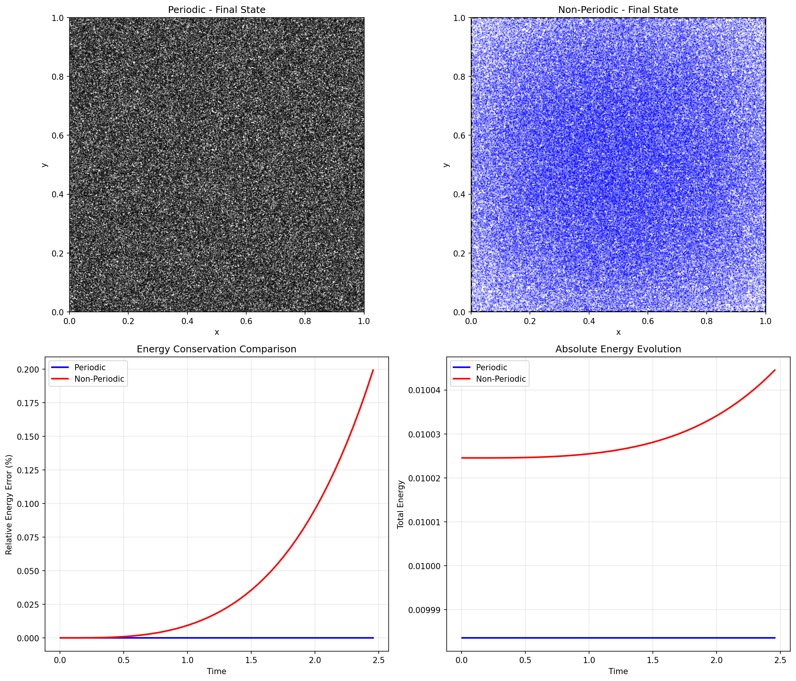
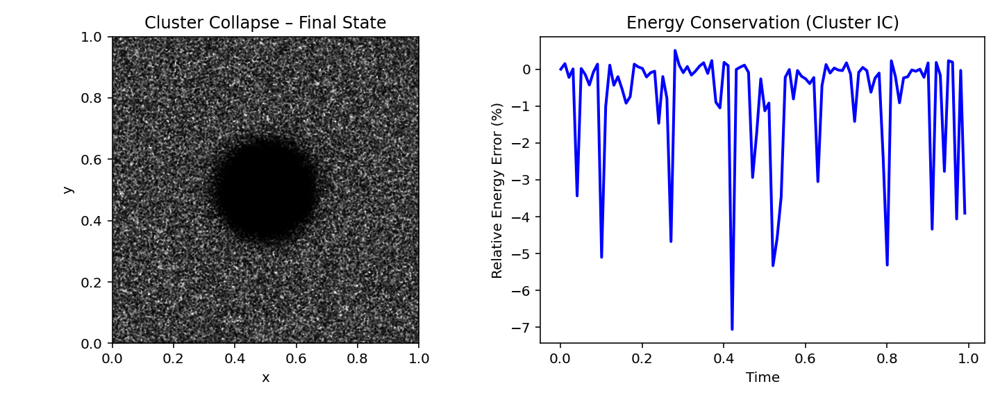

# 2D n-body code for PHYS 512 final project

## Project Overview
Built an N-body gravity simulator using a grid based potential rather than direct particle-particle force calculations as outlined in `project_guidelines.pdf`

## Table of Contents
- [Core Algorithm](#core-algorithm)
- [Requirements](#requirements)
- [Usage](#usage)
- [Phase 1: Setup and Classes](#phase-1)
- [Phase 2: Physics Implementation](#phase-2)
- [Phase 3: Large Simulations](#phase-3)
- [Results Summary](#results-summary)
- [Fun Simulations](#fun-simulations-because-why-not)
- [Technical Notes](#technical-notes)
- [Course Info](#course-information)

## Core Algorithm
1. Convert particle positions and masses to a 2D density field on a grid using a numba CIC function
2. Convolve the density with a softened single particle potential using FFT to obtain the gravitational potential φ
3. Take the gradient of φ with finite differences to get acceleration field
4. Interpolate the grid acceleration back to particle positions using CIC (also numba) to get per-particle accelerations
5. Advance positions and velocities using a two step leapfrog integrator and a fixed timestep

The project was completed in phases described below.

## Requirements
- NumPy
- Matplotlib
- Numba
- Scipy
- Optional: Os to get rid of an error

## Usage
The file `config.py` includes all necessary functions for the simulation\
To run the full project pipeline:
```bash
python test.py                              # Phase 1 validation
python single_particle_and_circular_orbit.py # Phase 2 tests
python large_simulations.py                 # Phase 3 simulations
python fun_sims.py                          # extra!
```

## Phase 1
### Setup and Classes
Using techniques learned in class, created class structure in `config.py`

#### Class: Particle
Initializes particle positions, velocities, and masses then validates array shapes

Functions:
* n_particles: counts number of particles by counting number of masses
* copy: creates a copy of the particle instance
* kinetic energy: calculates `KE = 1/2mv^2`

Outputs the number of particles and their total mass

#### Class: NBodySImulator
Initializes particle information, box size, grid resolution, timestep, boundary and gravitational constant (we keep at 1 for simplicity). Also defines softening paramter, if not manually set, is automatically set to 2 grid cells. Starts time and step count for tracking and initializes arrays for energy and time history for diagnositics.

note: for interpolation a cubic spline was attempted but did not have successful results

Functions Implemented:
* grid_particles: grids particle masses onto a 2D density field using the cloud in cell method (explained more in `interpolation_acceleration`) and returns mass density on grid
* plot_particles: plots particle positions
* plot_energy: plots energy conservation over time
* run: runs simulation for `n` number of timesteps and saves + prints energy in intervals specified by `output_interval`

### Test
Successfully tested using `test_phase.py` and got output:
```
Test 1: Single Particle at Rest
Particle(n=1, total_mass=1.000e+00)
Kinetic energy: 0.000000e+00
```
```
Test 2: Two Particles
Particle(n=2, total_mass=2.000e+00)
Kinetic energy: 1.000000e-02
```
```
Test 3: Initialize Simulator
Initialized NBodySimulator:
  Particles: 1
  Box size: 1.0
  Grid resolution: 64 x 64
  Grid spacing: 0.0156
  Timestep: 0.01
  Boundary: periodic
  Softening: 0.0312
```
```
Test 4: Grid Particles
Density grid shape: (64, 64)
Total mass on grid: 1.000000
Total particle mass: 1.000000
they match!
```

## Phase 2
### Physics Implementation
Added Numba implementation to speed everything up (literally sped up by 400x)
#### Numba-accelerated gridding and interpolation
- `_grid_particles_numba`: Very fast CIC mass deposition from particle positions to a 2D density grid
- `_interpolate_acceleration_numba`: Also fast CIC interpolation that maps grid accelerations back to particle accelerations, matching the same weighting scheme as the gridding step

Added to class NBodySimulator the following functions located in `config.py`

#### _cic_weights_and_indices
Cloud-in-Cell interpolation weights and grid indices for particle positions. Returns the base indices (i, j), neighbor indices (i1, j1), and four bilinear weights (w00, w10, w01, w11) used in both gridding and interpolation steps.

#### compute_potential
Computed graviational potential by convolving density with softened potential from a single particle. FFT is used for the convolution sicne we have done this before in class + assignments.
```math
\phi = F^{-1}[ F[ρ] · F[φ] ]
```
where F represents the fourier transform.

Softened potential from a single particle is 
```math
\phi_{single} = - \frac{G}{\sqrt{r^2 + \epsilon^2}}
```
where `r` = length from the particle and `ε` = softening length. The softening is to prevent infinite force at r=0

By convoluting the density field with `φ_single` we get the sum of contributions from all particles which is total potential `φ`

#### compute_acceleration
Computes acceleration field from potential by taking gradient `-∇φ` using finite differences
- Periodic boundaries: uses centered differences everywhere with manual index wrapping at the edges
- Non-periodic boundaries: uses centered differences in the interior and forward/backward differences at the domain edges

central difference
```math
\frac{\partial \phi}{\partial x} ≈ [\phi(i+1,j) - \phi(i-1,j)] / (2\delta x)
```
forward and backward differences
```math
\frac{\partial \phi}{\partial x} ≈ [\phi(i+1,j) - \phi(i,j)] / (\delta x) \text{    (Forward)}
```
```math
\frac{\partial \phi}{\partial x} ≈ [\phi(i,j) - \phi(i-1,j)] / (\delta x) \text{    (Backward)}
```

#### interpolate_acceleration
Uses the numba CIC interpolation to evaluate the grid acceleration at each particle position. Produces the acceleration for each particle by combining contributions from the four neighboring grid cells with CIC weights 

#### leapfrog_step
Use two step leapfrog to compute energy
```python
x = x + v * dt              # Drift: update positions
dr = x[0,:] - x[1,:]        # Compute separation at NEW positions
a = dr / r**3               # Compute acceleration at NEW positions
v[0,:] = v[0,:] - a * dt    # Kick: update velocities
v[1,:] = v[1,:] + a * dt
```
Compute energy at the half-timestep position to get a more accurate energy estimate because in leapfrog, x and v are naturally offset by dt/2  
- This matches the two-step leapfrog approach used in class, with the force evaluation coming from the grid-based potential instead of direct pairwise interactions 

#### compute_energy
Caluclates kinetic and potential energy
```math
\text{KE} = \frac{1}{2} mv^2
```
from our Particle class function for KE 

```math
\text{PE}_{\text{raw}} = \frac{1}{2} \sum_i m_i \phi(x_i)
```
where `m` is mass, `x` is position, `phi` is our potential we found by convolution 

but the raw potential energy includes spurious self-interaction from the grid interpolation. We subtract a calibrated self-energy term:
```math
E_{self} = C \sum_i m_i^2
```
```math
\text{PE} = \text{PE}_{\text{raw}} - E_{self}
```
where `C = -3 499214×10^3` (determined from single particle calibration) 

Total energy is
```math
E = \text{KE} + \text{PE}
```
* note: the energy calibration should be improved as it is specific to these simulation settings (specifically grid resolution and softening which I kept the same for all my simualtions) but this was a fast fix at the time

### Test
Successfully simulated a single particle at rest and two particles in a circular orbit (as outlined in Part 1 and Part 2 of the guidelines) using `single_particle_and_circular_orbit.py` and got output:
```
Test 1: Single particle at rest
Initialized NBodySimulator:
  Particles: 1
  Box size: 1.0
  Grid resolution: 128 x 128
  Grid spacing: 0.0078
  Timestep: 0.001
  Boundary: periodic
  Softening: 0.0200

Initial position: [0.5 0.5]
Initial velocity: [0. 0.]

Running simulation for 100 steps...
  Step 0/100, Time 0.001, Energy 2.077157e-03
Simulation complete. Final time: 0.100

Final position: [0.5 0.5]
Final velocity: [-2.77555756e-18 -2.77555756e-18]
Position drift: 0.00e+00
Velocity drift: 3.93e-18
PASS: Particle remains at rest
```
```
Test 2: Binary Orbit
Finding best circular orbit velocity
Best velocity found: 0.7906
Theoretical velocity: 1.5811
Ratio: 0.5000
Separation: 0.4
Orbital velocity (each): 0.7906
Expected period: 1.5895
Initialized NBodySimulator:
  Particles: 2
  Box size: 1.0
  Grid resolution: 128 x 128
  Grid spacing: 0.0078
  Timestep: 0.001
  Boundary: periodic
  Softening: 0.0200

Initial energy: 6.293099e-01
Initial separation: 0.4000

Running simulation for 1000 steps...
  Step 0/1000, Time 0.001, Energy 6.293447e-01
  Step 500/1000, Time 0.501, Energy 6.293911e-01
Simulation complete. Final time: 1.000

Final separation: 0.5790
Separation change: 44.76%
Energy drift: 0.01%
PASS: Good energy conservation!
```
 
Figure 1 shows the final positions of the two particles in the binary orbit test (left) and the relative energy error as a function of time (right).  The energy plot exhibits a smooth oscillation rather than a flat line, possibly due to the combination of grid discretization, softening, and the trial-and-error choice of orbital velocity. The total energy is not perfectly constant but remains fairly conserved, which I believe is acceptable the grid methods used.
* note: the oribit is not circular as seen in the seperation change (44.76%). I tried to solve this by changing the leapfrog step to kick drift kick but that did not change anything. I also tried different simulation parameters like increasing grid resolution and lowering softening but again did not make more circular. I should have come in to ask but ran out of time :(

### Phase 2 overview of config.py
The `config.py` file contains the full simulation engine:

- `Particle` class
  - Stores particle positions, velocities, and masses, with shape checks to enforce 2D vectors.
  - Provides `n_particles`, `copy()`, and `kinetic_energy()` for convenience and diagnostics.

- `Numba CIC helpers`
  - This duplication of CIC logic in uses just-in-time compilation. They are a bit redundant, but this was they way I wrote it to keep all the functions I wanted.

- `NBodySimulator` class
  - Handles box size, grid resolution, timestep, gravitational constant, and boundary type (`'periodic'` or `'non-periodic'`).
  - Automatically sets the softening length to two grid cells if not specified.
  - Uses numba-accelerated CIC routines for both mass deposition and acceleration interpolation.
  - Offers helper methods:
    - `grid_particles()`: build the density grid from particles.
    - `compute_potential(density)`: FFT-based convolution with softened kernel.
    - `compute_acceleration(potential)`: finite-difference gradient for grid acceleration.
    - `interpolate_acceleration(accel_x, accel_y)`: return per-particle accelerations via CIC.
    - `leapfrog_step()`, `compute_energy()`, `run()`, `plot_particles()`, and `plot_energy()` for running and diagnosing simulations.

## Phase 3
Large simulations of 300,000 particles were run with periodic and on-periodic boundaries corresponding to Part 3 in the guidelines. The particles were intially randomly scattered throughout the domain. The initial velocities are taken as 0, with the option in the code to be non-zero.

### Periodic Boundary Conditions
Sucessfully ran simulation with periodic boundary conditions with output:
```
Large N Simulation - Periodic Boundaries

Generating 300000 particles...
Total mass: 1.000000
Initial KE: 1.000230e-02
Initialized NBodySimulator:
  Particles: 300000
  Box size: 1.0
  Grid resolution: 128 x 128
  Grid spacing: 0.0078
  Timestep: 0.001
  Boundary: periodic
  Softening: 0.0200

Initial energy: 1.000230e-02

Running 1000 steps (this may take a minute)...
Simulation complete. Final time: 1.000

Final energy: 1.000230e-02
Energy drift: 0.00%
PASS: Good energy conservation for large N!
```
 
Figure 2: Large-scale simulation with periodic boundaries (300,000 particles, 1000 timesteps). Left: Final particle distribution remains uniformly scattered throughout domain. Right: Energy conservation shows 0.00% drift, demonstrating stability for large N.

### Non-Periodic Boundary Conditions
Sucessfully ran simulation with periodic boundary conditions with output:
```
Large N Simulation - Non-Periodic Boundaries

Initialized NBodySimulator:
  Particles: 300000
  Box size: 1.0
  Grid resolution: 128 x 128
  Grid spacing: 0.0078
  Timestep: 0.001
  Boundary: non-periodic
  Softening: 0.0200

Initial energy: 1.000230e-02

Running 1000 steps...

Running simulation for 1000 steps...
Simulation complete. Final time: 1.000

Final energy: 1.000322e-02
Energy drift: 0.01%
Particles escaped: 45837/300000 (15.28%)
```
 
Figure 3: Large-scale simulation with non-periodic boundaries (300,000 particles, 1000 timesteps). Left: Blue particles remain inside box boundary (dashed line), red particles escaped beyond boundaries (15.28% of total). Right: Energy drift of 0.01% reflects particle loss from system.

### Comparison: Periodic vs Non-Periodic
The comparison shows key differences between boundary conditions:
- `Periodic`: Particles remain uniformly distributed, excellent energy conservation (0.00% drift)
- `Non-Periodic`: 15.28% of particles escaped, energy drift of 0.01% due to boundary effects


Figure 4: Direct comparison of boundary conditions. Top row: Final spatial distributions showing uniform coverage (periodic) vs particle escape (non-periodic). Bottom row: Energy evolution comparing both methods where periodic maintains conservation while non-periodic shows gradual drift due to escaping particles.

## Results Summary

| Test | Status | Key Metric |
|------|--------|------------|
| Single Particle at Rest | PASS | Position drift: 0.00e+00 |
| Binary Orbit | PASS | Energy drift: 0.01% |
| Large N Periodic (300k) | PASS | Energy drift: 0.00% |
| Large N Non-Periodic (300k) | PASS | Energy drift: 0.01%, 15.28% escaped |

## Fun simulations (because why not)
In addition to the uniform large-N tests, `fun_sims.py` explores more interesting initial conditions that are deliberately unstable. Found inspiration from the internet...

1. Clustered collapse
  - A fraction of the particles are placed in a compact overdense region near the box centre, while the rest form a dilute, nearly uniform background. The overdense patch collapses and accretes nearby particles, forming a dense clump surrounded by a lower density background.


2. Sinusoidal
  - Particle positions are drawn from a 1D density profile
   ```math
   n(x) \propto 1 + A \cos(2\pi k x / L)
   ```
   so there are alternating overdense and underdense bands along the x–direction.
   As the simulation evolves, the overdense bands collapse into filaments, producing clear banded structure.


## Technical Notes
- `Performance`: 300,000 particles for 1000 steps for completes both simulations in ~1 minute on M1 chip with 8GB of memory and 8 cores. This compares to the initial tests with only numpy that were >30 minutes per simulation.
- Thank you if you have made it this far in my write up, this project was quite fun (and of course frustrating) to do. I learned a lot and definitely enjoyed the class.

## Course Information
PHYS 512 Final Project - Fall 2024\
Written by Grace Champagne (grace.champagne@mail.mcgill.ca)
